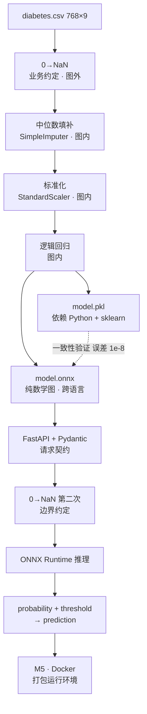

```mermaid
flowchart TD
    A["diabetes.csv 768×9"] --> B["0→NaN<br/>业务约定 · 图外"]
    B --> C["中位数填补<br/>SimpleImputer · 图内"]
    C --> D["标准化<br/>StandardScaler · 图内"]
    D --> E["逻辑回归<br/>图内"]
    E --> F["model.pkl<br/>依赖 Python + sklearn"]
    E --> G["model.onnx<br/>纯数学图 · 跨语言"]
    F -.->|"一致性验证 误差 1e-8"| G
    G --> H["FastAPI + Pydantic<br/>请求契约"]
    H --> I["0→NaN 第二次<br/>边界约定"]
    I --> J["ONNX Runtime 推理"]
    J --> K["probability + threshold<br/>→ prediction"]
    K --> L["M5 · Docker<br/>打包运行环境"]

```
